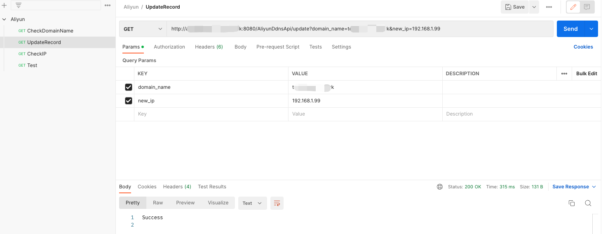
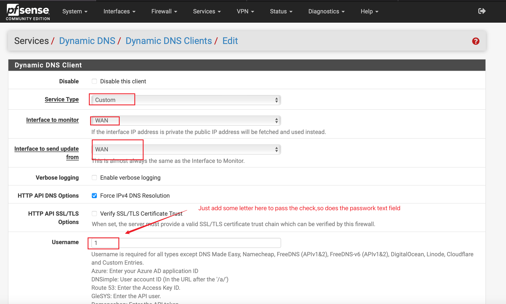
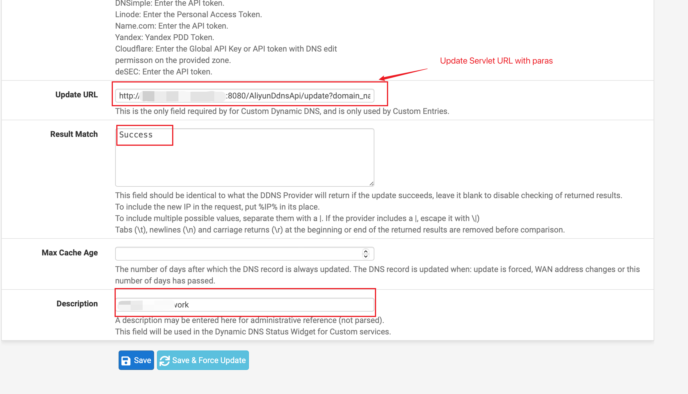
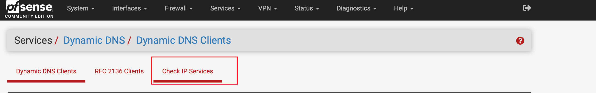
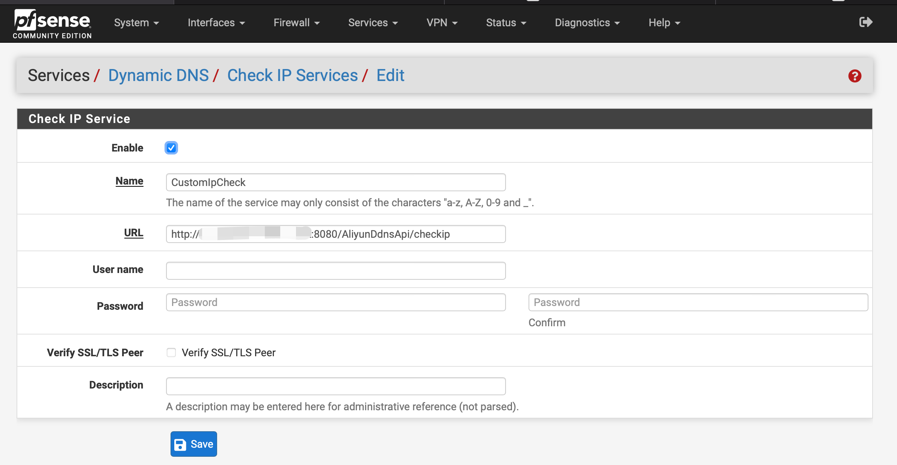

# Aliyun DDNS API For Pfsense or OPNsense

>  An servlet project for aliyun ddns api for OPNsense or Pfsense (Which not support Aliyun's DDNS) 

### Consist of 3 servlets

1. Update servlet : Update dns A record, needs domain name and ip address 2 paras
2. Check servlet : Check if record is correctly being resolve, "Correct" as return when the resolving is right,needs domain name and check ip 2 para
3. CheckIp servlet : Tell the client's public ip when accessing to it

```xml
<!DOCTYPE web-app PUBLIC
 "-//Sun Microsystems, Inc.//DTD Web Application 2.3//EN"
 "http://java.sun.com/dtd/web-app_2_3.dtd" >

<web-app>
  <display-name>Aliyun DDNS</display-name>

  <servlet>
    <servlet-name>update</servlet-name>
    <servlet-class>com.caliburn.servlet.UpdateDomainName</servlet-class>
  </servlet>
  <servlet-mapping>
    <servlet-name>update</servlet-name>
    <url-pattern>/update</url-pattern>
  </servlet-mapping>

  <servlet>
    <servlet-name>check</servlet-name>
    <servlet-class>com.caliburn.servlet.CheckDomainName</servlet-class>
  </servlet>
  <servlet-mapping>
    <servlet-name>check</servlet-name>
    <url-pattern>/check</url-pattern>
  </servlet-mapping>

  <servlet>
    <servlet-name>checkip</servlet-name>
    <servlet-class>com.caliburn.servlet.CheckIP</servlet-class>
  </servlet>
  <servlet-mapping>
    <servlet-name>checkip</servlet-name>
    <url-pattern>/checkip</url-pattern>
  </servlet-mapping>
</web-app>
```


### Configuring Aliyun account info

> You need 1st tell the service what your aliyun account is by editing [AliyunDDNSapi](https://github.com/TabbycatPie/AliyunDDNSapi)/[src](https://github.com/TabbycatPie/AliyunDDNSapi/tree/main/src)/[main](https://github.com/TabbycatPie/AliyunDDNSapi/tree/main/src/main)/[resources](https://github.com/TabbycatPie/AliyunDDNSapi/tree/main/src/main/resources)/**AliyunAPIKey.properties** this file

```properties
accessid = <your api key here>
passcode = <your api passcode here>
```


### HOW TO USE

> Pretty simple
>
> 1. Deploy tomcat. , start tomcat,open firewall if needed
> 2. Copy release ***.war*** file to /tomcat/webapp/ folder
> 3. Startup tomcat
> 4. Test service with Postman or something
> 5. Config on your Pfsense or OPNsense

#### Test Service with Postman



#### Config Pfsense

> Using %IP% to fill the update URL where your public IP is like follow
>
> Update URL(Eg.):http://***< your server ip >***:8080/AliyunDdnsApi/update?domain_name=***< domain name you want to update >***&new_ip=%IP%





#### Config check ip service

> In china you cant access system defualt service to get public IP address, you have to config a custom ip checking service as follow




